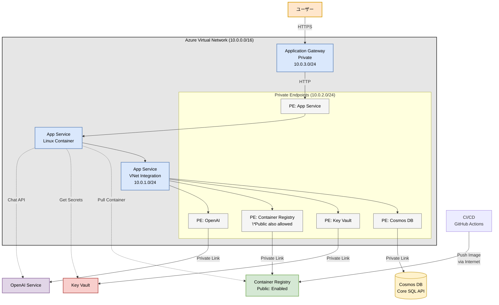

# ChatGPT 風アプリケーション設計書

## 1. システムアーキテクチャ

### 1.1 全体構成図

- **デプロイリージョン**: 東日本 (Japan East) ※OpenAI Service 除く
- **ホスティング**: Azure App Service (Linux Container)
- **コンテナレジストリ**: Azure Container Registry
- **データベース**: Azure Cosmos DB (Core SQL API)
- **AI/ML**: Azure OpenAI Service (最新モデル対応リージョン)
- **シークレット管理**: Azure Key Vault
- **ロードバランサー**: Azure Application Gateway (v2 Basic SKU, Preview)
- **IaC**: Terraform
- **認証**: Azure App Service Easy Auth (Azure AD)



### 1.2 ネットワーク設計

#### サブネット構成

- **Virtual Network**: 10.0.0.0/16
  - **AppServiceSubnet**: 10.0.1.0/24 (App Service VNet 統合用)
  - **PrivateEndpointSubnet**: 10.0.2.0/24 (Private Endpoint 用)
  - **ApplicationGatewaySubnet**: 10.0.3.0/24 (Application Gateway 用)

#### NSG (ネットワークセキュリティグループ) 設計

**設計方針:**

- ゼロトラストの原則に基づき、必要な通信のみを明示的に許可する
- その他すべての通信は明示的に拒否する（優先度 4096 の DenyAll ルール）
- 各サブネットの役割に応じた最小限の通信規則を設定

##### AppServiceSubnet NSG

**受信セキュリティ規則:**

なし

**送信セキュリティ規則:**
| 優先度 | 名前 | ソース | ソースポート | 宛先 | 宛先ポート | プロトコル | アクション |
| ------ | ---------------------------- | -------------- | ------------ | ----------- | ---------- | ---------- | ---------- |
| 100 | AllowPrivateEndpointOutbound | VirtualNetwork | _ | 10.0.2.0/24 | 443 | TCP | 許可 |
| 110 | AllowInternetOutbound | VirtualNetwork | _ | Internet | 443 | TCP | 許可 |
| 4096 | DenyAllOutbound | \* | \* | \* | \* | \* | 拒否 |

##### PrivateEndpointSubnet NSG

**受信セキュリティ規則:**
| 優先度 | 名前 | ソース | ソースポート | 宛先 | 宛先ポート | プロトコル | アクション |
|--------|------|--------|--------------|------|------------|------------|------------|
| 100 | AllowAppServiceSubnetInbound | 10.0.1.0/24 | _ | VirtualNetwork | 443 | TCP | 許可 |
| 110 | AllowApplicationGatewayInbound | 10.0.3.0/24 | _ | VirtualNetwork | 443 | TCP | 許可 |
| 4096 | DenyAllInbound | \* | \* | \* | \* | \* | 拒否 |

**送信セキュリティ規則:**
| 優先度 | 名前 | ソース | ソースポート | 宛先 | 宛先ポート | プロトコル | アクション |
|--------|------|--------|--------------|------|------------|------------|------------|
| 4096 | DenyAllOutbound | \* | \* | \* | \* | \* | 拒否 |

##### ApplicationGatewaySubnet NSG

**受信セキュリティ規則:**
| 優先度 | 名前 | ソース | ソースポート | 宛先 | 宛先ポート | プロトコル | アクション |
|--------|------|--------|--------------|------|------------|------------|------------|
| 100 | AllowCorpNetInbound | 社内ネットワーク IP 範囲 | _ | VirtualNetwork | 443 | TCP | 許可 |
| 4095 | AllowAzureLoadBalancer | AzureLoadBalancer | _ | \* | \* | \* | 許可 |
| 4096 | DenyAllInbound | \* | \* | \* | \* | \* | 拒否 |

**送信セキュリティ規則:**
| 優先度 | 名前 | ソース | ソースポート | 宛先 | 宛先ポート | プロトコル | アクション |
|--------|------|--------|--------------|------|------------|------------|------------|
| 100 | AllowPrivateEndpointOutbound | VirtualNetwork | \_ | 10.0.2.0/24 | 443 | TCP | 許可 |
| 4096 | DenyAllOutbound | \* | \* | \* | \* | \* | 拒否 |

**注意:** プライベート Application Gateway では GatewayManager のインバウンド規則は不要です。必要な規則は正常性プローブのための AzureLoadBalancer からの受信許可のみです。

https://learn.microsoft.com/ja-jp/azure/application-gateway/application-gateway-private-deployment?tabs=portal#network-security-group-control

#### Private Endpoint

- Cosmos DB 用 Private Endpoint
- Key Vault 用 Private Endpoint
- Container Registry 用 Private Endpoint（パブリックアクセスも許可）
- OpenAI Service 用 Private Endpoint
- App Service 用 Private Endpoint

#### DNS 設定

- Private DNS Zones:
  - privatelink.documents.azure.com (Cosmos DB)
  - privatelink.vaultcore.azure.net (Key Vault)
  - privatelink.azurecr.io (Container Registry) \*VNet 内からのアクセス用
  - privatelink.openai.azure.com (OpenAI)
  - privatelink.azurewebsites.net (App Service)

#### 通信フロー

1. **ユーザーアクセス**

   - 社内ネットワーク → Application Gateway (443/HTTPS)
   - Application Gateway → App Service Private Endpoint (443/HTTPS)

2. **App Service からの通信**

   - App Service → Key Vault Private Endpoint (443/HTTPS) - シークレット取得
   - App Service → Container Registry Private Endpoint (443/HTTPS) - イメージプル
   - App Service → Cosmos DB Private Endpoint (443/HTTPS) - データ読み書き
   - App Service → OpenAI Private Endpoint (443/HTTPS) - API 呼び出し
   - App Service → Azure AD (443/HTTPS) - 認証トークン検証

3. **CI/CD からの通信**
   - GitHub Actions → Container Registry パブリックエンドポイント (443/HTTPS) - イメージプッシュ

### 1.3 セキュリティ設計

#### 認証・認可

- **ユーザー認証**: App Service Easy Auth (Azure AD)
- **サービス間認証**: ユーザー割り当てマネージド ID
- **API 認証**: Azure AD トークン検証

#### シークレット管理

- OpenAI API キー: Key Vault に格納
- Cosmos DB 接続文字列: Key Vault に格納
- App Service から Key Vault 参照を使用
- Key Vault は RBAC でアクセス制御
  - App Service のユーザー割り当てマネージド ID に "Key Vault Secrets User" ロールを付与

#### ネットワークセキュリティ

- すべての PaaS サービスは Private Endpoint 経由でアクセス（Container Registry を除く）
- Container Registry は CI/CD からのプッシュのためパブリックアクセスを許可
- その他の PaaS サービスはパブリックアクセスを無効化
- Application Gateway は社内ネットワークからのみアクセス可能

## 2. アプリケーション設計

### 2.1 フロントエンド (Next.js)

#### ディレクトリ構造

```
src/
├── app/
│   ├── layout.tsx          # ルートレイアウト
│   ├── page.tsx            # メインチャットページ
│   ├── api/               # API Routes (BFF)
│   │   ├── chat/
│   │   │   └── route.ts   # チャットAPI
│   │   ├── models/
│   │   │   └── route.ts   # モデル一覧API
│   │   └── auth/
│   │       └── route.ts   # 認証関連API
│   └── globals.css        # グローバルスタイル
├── components/
│   ├── chat/
│   │   ├── ChatContainer.tsx    # チャットコンテナ
│   │   ├── MessageList.tsx      # メッセージ一覧
│   │   ├── MessageItem.tsx      # 個別メッセージ
│   │   ├── InputArea.tsx        # 入力エリア
│   │   └── ModelSelector.tsx    # モデル選択
│   └── ui/                       # shadcn/uiコンポーネント
├── lib/
│   ├── api-client.ts            # API通信ユーティリティ
│   ├── auth.ts                  # 認証ヘルパー
│   └── utils.ts                 # 共通ユーティリティ
└── types/
    └── index.ts                 # 型定義
```

#### 主要コンポーネント

1. **ChatContainer**

   - チャット全体の状態管理
   - メッセージ履歴の管理
   - API との通信制御

2. **MessageList**

   - メッセージ一覧表示
   - 自動スクロール制御
   - レスポンシブ対応

3. **InputArea**

   - テキスト入力
   - 送信処理
   - 送信中の状態管理

4. **ModelSelector**
   - モデル一覧取得
   - モデル選択 UI
   - 選択状態の永続化

### 2.2 バックエンド (FastAPI)

#### ディレクトリ構造

```
api/
├── main.py                  # FastAPIアプリケーション
├── routers/
│   ├── chat.py             # チャット関連エンドポイント
│   ├── models.py           # モデル関連エンドポイント
│   └── health.py           # ヘルスチェック
├── services/
│   ├── openai_service.py   # OpenAI通信サービス
│   ├── cosmos_service.py   # Cosmos DB操作サービス
│   └── auth_service.py     # 認証サービス
├── models/
│   ├── chat.py            # チャットデータモデル
│   └── user.py            # ユーザーデータモデル
├── core/
│   ├── config.py          # 設定管理
│   ├── security.py        # セキュリティ関連
│   └── dependencies.py    # 依存性注入
└── utils/
    └── streaming.py       # SSEストリーミング
```

#### API 設計

1. **POST /api/chat/send**

   - リクエスト: メッセージ、モデル、会話 ID
   - レスポンス: SSE ストリーム
   - 処理: OpenAI API を呼び出し、ストリーミング返却

2. **GET /api/chat/history**

   - パラメータ: conversationId, limit, offset
   - レスポンス: メッセージ配列
   - 処理: Cosmos DB から履歴取得

3. **GET /api/models**
   - レスポンス: 利用可能モデル一覧
   - 処理: OpenAI API からモデル一覧取得

### 2.3 データベース設計 (Cosmos DB)

#### コンテナ構成

1. **conversations コンテナ**

   - パーティションキー: `/userId`
   - 項目:
     ```json
     {
       "id": "uuid",
       "userId": "user-id",
       "title": "New Chat",
       "createdAt": "2024-01-01T00:00:00Z",
       "updatedAt": "2024-01-01T00:00:00Z",
       "messageCount": 0
     }
     ```

2. **messages コンテナ**
   - パーティションキー: `/conversationId`
   - 項目:
     ```json
     {
       "id": "uuid",
       "conversationId": "conversation-id",
       "userId": "user-id",
       "role": "user|assistant",
       "content": "message content",
       "model": "gpt-4o",
       "timestamp": "2024-01-01T00:00:00Z",
       "tokenCount": 100
     }
     ```

## 3. デプロイメント設計

### 3.1 コンテナ構成

#### Dockerfile (マルチステージビルド)

```dockerfile
# ビルドステージ
FROM node:20-alpine AS builder
WORKDIR /app
COPY package*.json ./
RUN npm ci
COPY . .
RUN npm run build

# FastAPIステージ
FROM python:3.11-slim
WORKDIR /app
COPY requirements.txt .
RUN pip install --no-cache-dir -r requirements.txt
COPY api/ ./api/

# Next.jsビルド成果物をコピー
COPY --from=builder /app/.next ./.next
COPY --from=builder /app/public ./public
COPY --from=builder /app/package*.json ./

# Node.js実行環境
RUN apt-get update && apt-get install -y nodejs npm
RUN npm ci --production

# 起動スクリプト
COPY start.sh .
RUN chmod +x start.sh

EXPOSE 8000
CMD ["./start.sh"]
```

## 4. インフラストラクチャ設計

### 4.1 Terraform モジュール構成

```
infra/
├── main.tf              # メインファイル（全リソース定義）
├── variables.tf         # 変数定義
├── outputs.tf          # 出力定義
└── terraform.tfvars    # 変数値
```

### 4.2 主要リソースの SKU 選定

| リソース            | SKU                 | 理由                                                   |
| ------------------- | ------------------- | ------------------------------------------------------ |
| App Service Plan    | B1 (Basic)          | 最小コスト、開発環境向け                               |
| Cosmos DB           | Serverless          | 使用量ベース課金、低コスト                             |
| Application Gateway | Basic (v2, Preview) | ゾーン冗長対応、WAF 不要、基本機能で十分               |
| Container Registry  | Basic               | 最小ストレージで十分、CI/CD 用にパブリックアクセス許可 |
| Key Vault           | Standard            | ゾーン冗長対応、Premium 機能不要                       |
| OpenAI              | Standard            | 通常利用には十分                                       |

### 4.3 可用性とバックアップ設計

#### 可用性ゾーン対応

- **デプロイリージョン**: 東日本 (Japan East) - 可用性ゾーン対応リージョン
- **Application Gateway**: v2 Basic SKU（プレビュー）でゾーン冗長対応
- **Key Vault**: Standard SKU で既定のゾーン冗長対応
- **OpenAI Service**: 最新モデル対応リージョン（東日本以外の可能性）
- **その他のリソース**: 単一ゾーン構成（コスト最適化）

#### 将来的な拡張

- **App Service**: Premium プランでゾーン冗長化
- **Cosmos DB**: ゾーン冗長レプリケーション
- **Container Registry**: Premium SKU でゾーン冗長化

#### バックアップ・DR 設計

- **Cosmos DB**: 自動バックアップ（4 時間ごと）
- **Container Registry**: イメージのバージョニング
- **可用性目標**: 99%以上（計画メンテナンス除く）

## 5. 開発環境設定

### 5.1 ローカル開発

```bash
# 環境変数設定
AZURE_OPENAI_ENDPOINT=https://xxx.openai.azure.com/
AZURE_OPENAI_KEY=xxx
COSMOS_DB_ENDPOINT=https://xxx.documents.azure.com:443/
COSMOS_DB_KEY=xxx

# 開発サーバー起動
npm run dev      # Next.js
uvicorn api.main:app --reload  # FastAPI
```

### 5.2 開発ツール

- VS Code 拡張機能
  - Azure Tools
  - Python
  - ESLint
  - Prettier
- Docker Desktop
- Azure CLI
- Terraform CLI
